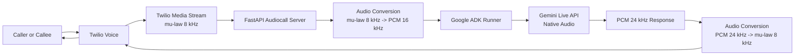
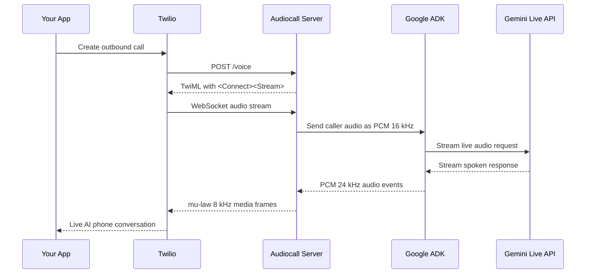

# Audiocall

> Open source AI phone calling with Twilio Media Streams, FastAPI, Google ADK, and Gemini Live API.

[](https://www.python.org/)
[](https://fastapi.tiangolo.com/)
[](https://www.twilio.com/voice)
[](https://google.github.io/adk-docs/)
[](https://ai.google.dev/)
[](https://github.com/Iamsdt/audiocall)

Audiocall is a real-time voice agent for phone calls. It lets you call any number through Twilio, stream live audio into Google ADK, generate natural speech with Gemini Live API, and send the response back to the caller with low-latency bidirectional audio.

If you are building an AI calling agent, outbound voice bot, phone interview assistant, recruiter bot, support line, or multilingual voice assistant, this repository gives you a clean starting point.

## Why Audiocall

- Real phone calls, not browser-only demos
- Bidirectional streaming over Twilio Media Streams
- Native audio pipeline with Google ADK and Gemini Live API
- FastAPI server that is easy to run locally or deploy
- Works for outbound calls and inbound webhook-driven calls
- Includes audio transcoding between Twilio and Gemini audio formats
- Tuned for faster turn-taking and interruption handling

## Architecture



## Call Flow



## What You Can Build

- AI cold calling and outbound sales assistants
- Voice-based job screening or recruiting flows
- Customer support phone bots
- Appointment reminders and confirmation calls
- Multilingual voice assistants for regional users
- Internal operations agents that call leads, candidates, or customers

## Tech Stack

- Python 3.13+
- FastAPI
- Twilio Voice API and Media Streams
- Google ADK
- Gemini Live API or Vertex AI Live API
- audioop-lts for audio transcoding on Python 3.13+

## Quick Start

### 1. Install

```bash
pip install -e .
```

### 2. Configure environment

```bash
cp .env.example .env
```

Fill in the required values in `.env`.

### 3. Expose your local server

Twilio needs a public URL. For local development, use ngrok:

```bash
ngrok http 8000
```

Copy the public hostname and place it in `SERVER_HOST` without `https://`.

Example:

```bash
SERVER_HOST=abc123.ngrok-free.app
USE_TLS=true
```

### 4. Start the server

```bash
python -m audiocall.main
```

You can also run it with Uvicorn directly:

```bash
uvicorn audiocall.main:app --host 0.0.0.0 --port 8000
```

### 5. Trigger a phone call

```bash
curl -X POST https://your-public-host/call \
  -H "Content-Type: application/json" \
  -d '{"to": "+15551234567"}'
```

curl -X POST https://nqpg4hnn-8000.inc1.devtunnels.ms/call \
  -H "Content-Type: application/json" \
  -d '{"to": "+15551234567"}'


curl -X POST https://nqpg4hnn-8000.inc1.devtunnels.ms/call   -H "Content-Type: application/json"   -d '{"to": "+919787962328"}'

curl -X POST https://audio-call.10xscale.ai/call \
  -H "Content-Type: application/json" \
  -d '{"to": "+919787962328"}'


Example response:

```json
{
  "call_sid": "CAxxxxxxxxxxxxxxxxxxxxxxxxxxxxxxxx",
  "status": "queued"
}
```

Once the callee answers, the call is bridged to the live AI agent.

## Configuration

### Required environment variables

| Variable | Required For | Description |
|---|---|---|
| `TWILIO_ACCOUNT_SID` | Twilio | Account SID from Twilio Console |
| `TWILIO_AUTH_TOKEN` | Twilio | Auth token from Twilio Console |
| `TWILIO_PHONE_NUMBER` | Twilio | Twilio number in E.164 format |
| `SERVER_HOST` | Server | Public hostname reachable by Twilio |
| `USE_TLS` | Server | `true` for HTTPS/WSS, `false` for local plain HTTP/WS |
| `PORT` | Server | Port used by the Uvicorn app |
| `AGENT_MODEL` | Google | Native audio Gemini model to use |

### Google AI Studio option

Use this for fast local setup and experimentation:

```bash
GOOGLE_GENAI_USE_VERTEXAI=FALSE
GOOGLE_API_KEY=your_google_api_key_here
AGENT_MODEL=gemini-2.5-flash-native-audio-preview-12-2025
```

### Vertex AI option

Use this for Google Cloud production setups:

```bash
GOOGLE_GENAI_USE_VERTEXAI=TRUE
GOOGLE_CLOUD_PROJECT=your_gcp_project_id
GOOGLE_CLOUD_LOCATION=us-central1
AGENT_MODEL=gemini-live-2.5-flash-native-audio
```

## API Endpoints

| Method | Endpoint | Purpose |
|---|---|---|
| `GET` | `/health` | Health check |
| `POST` | `/call` | Start an outbound phone call |
| `POST` | `/voice` | Twilio webhook that returns TwiML |
| `WS` | `/stream` | Bidirectional Twilio audio stream bridge |

## Audio Pipeline

Twilio and Gemini do not use the same wire format, so Audiocall performs live conversion in both directions.

| Direction | Format In | Conversion | Format Out |
|---|---|---|---|
| Twilio -> ADK | mu-law 8 kHz | `ulaw2lin` + `ratecv` 8k->16k | PCM-16 16 kHz |
| ADK -> Twilio | PCM-16 24 kHz | `ratecv` 24k->8k + `lin2ulaw` | mu-law 8 kHz |

This is handled with `audioop-lts`, a maintained replacement for the removed standard-library `audioop` module in Python 3.13+.

## Inbound Calls

If you want your Twilio number to receive inbound calls and connect them to the AI agent, set the voice webhook in the Twilio Console to:

```text
https://your-server-host/voice
```

Use `HTTP POST` as the webhook method.

## Agent Behavior

The current agent is configured as a voice-based job matching assistant.

It is designed to:

- greet callers naturally
- ask one question at a time
- adapt to the caller's language
- collect job preferences, skills, and contact details
- keep responses short and phone-friendly

The system also reduces pre-response latency by disabling Gemini dynamic thinking for the live session and supports interruption handling so the caller can cut in naturally.

## Customization

### Change the voice

Set a different prebuilt voice in `.env`:

```bash
AGENT_VOICE=Puck
```

Other supported voice names depend on the selected native audio model, with common examples including `Puck`, `Kore`, `Aoede`, `Leda`, `Orus`, and `Zephyr`.

### Change the agent prompt

Edit the instruction in `audiocall/agent.py` to turn this into a sales caller, support bot, booking assistant, or domain-specific phone agent.

### Change the model

Update `AGENT_MODEL` in `.env`.

## Project Structure

```text
audiocall/
├── __init__.py
├── agent.py        # Google ADK agent definition and voice config
└── main.py         # FastAPI app, Twilio hooks, WebSocket bridge, audio pipeline
.env.example        # Environment template
pyproject.toml      # Project metadata and dependencies
README.md           # Project documentation
```

## Security Notes

- Protect `/call` behind authentication before using it in production
- Validate Twilio webhook signatures with `X-Twilio-Signature`
- Keep API keys and Twilio credentials in environment variables or a secret manager
- Expect outbound calling to be billable and rate-limit access accordingly

## Deployment Notes

- Twilio must reach your app over a public URL
- Use `wss://` and `https://` in production
- Keep the server close to your telephony region if latency matters
- Vertex AI is the better fit for managed production environments

## Why This Repository Is Useful

Many AI voice demos stop at browser audio. Audiocall focuses on the harder and more useful problem: real telephone calls with real-time audio bridging between Twilio and a modern native-audio AI stack.

That makes it a strong starting point for anyone searching for:

- Twilio AI calling example
- Google ADK voice agent example
- Gemini Live API phone bot
- FastAPI Twilio Media Streams tutorial
- outbound AI phone call starter project

## Contributing

Contributions are welcome. Good improvements include:

- Twilio signature validation
- authentication for `/call`
- structured logging and analytics
- test coverage for audio conversion and webhooks
- Docker and deployment templates

## Star The Project

If this saved you time building a Twilio voice agent or Gemini Live phone bot, star the repository so more builders can find it.
